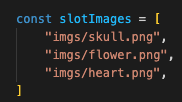
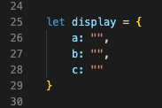

# GAMBLER RULES
Gambler is a slot machine game that you initiate by clicking the "BET" button. 
Once the button is clicked the screen will randomly display three images. 
If three of the same images appear on the screen, you win the game! Otherwise, you loose, but you get to try again for as many rounds as you'd like. 

<a href="https://migdelina17.github.io/GAMBLER/"> Play GAMBLER</a>

## JAVASCRIPT 

### slotImages array
/*----- constants -----*/
Create a slotImages array. It includes three images: skull.png which was the index of 0
flower.png which has the index of 1,
and heart.png with an index of 2.

### function getRandomImages
/*----- function -----*/
First function in JavaScript. Within the function, we are using the Math.random() method which is set to generate a random number from 0 through <1. We are adjusting the method by adding three (Math.random() *3) which then will generate random numbers from 0 through <3. This method gives us decimals, and to eliminate that, we added Math.floor to the method, which will round the random numbers to the lowest whole number being 0 through <3. 
The function is then asked to return slotImages and display the index that matches with the randomSpin number. 

For example: 
If you get random number 0, it'll match to the index 0 of the array which is skull.png and it will return that imaege.

If you randomly get 1 from randomSpin, it will return the index 1 image which is flower.png. 

randomSpin 2 = heart.png index2

you can console.log the function as follows for more visual details. 

console.log(getRandomImages()); 

### addEventListener
 /*----- cached element -----*/
Within our HTML we have the <button> tag with the ID of #betting. We access that element in JS using the ID and we assign it the new variable 'button'. 

/*----- event listeners -----*/
We then use the button variable and we add the event listener to it. The event listener will wait for a click and when it happens it will call on the playSlotMachine function. 

### display object
/*----- state -----*/
We create an object with three keys: a, b, and c. We assined empty strings to each to each key to create a place holder that we will be using later.

### function playSlotMachine
 /*----- function -----*/
We start by selecting our <main> tag using the #photos id that is attached to it. We then assign it an empty string to reset the element content to blank each time the function starts running. 

Next, we proceed with our slots. 

We create the 'img' element and assign it to variable firstslot. Next we assign key 'a' a new value, and that is the return of the getRandomImages function. 

Next line we change the sourse of the image tag by using the first slot variable and setting it to display.a.
Lastly, we select the <main> element by the 'photos' id and we append the first slot variable to it. 

We repeat these steps another two times but for keys b and c, and we finish our function by calling on the next which is displayMessage. 

### function displayMessage 
The function starts with the if statement to see if each element source property is equal to one another. 

Using the boolean if statement, we are comparing two operands with the logical conjuction operator (&&). This will return true, if and only both operands are true. 
We are able to compare the three slots using  using the keys a, b, and c, and their respective new values.
 
 If contion it met we play the win message and sound. Otherwise, our else statement will play the lost message and sound. 

# Next Steps: 
We plan on adding a balance section and setting different betting ammounts buttons. Additionally, will be adding different winning ammounts depending on image match.

    

